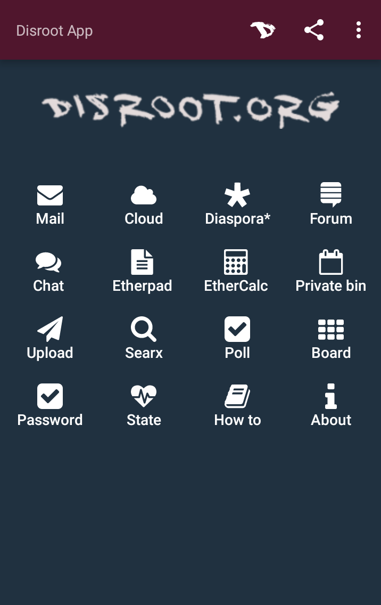
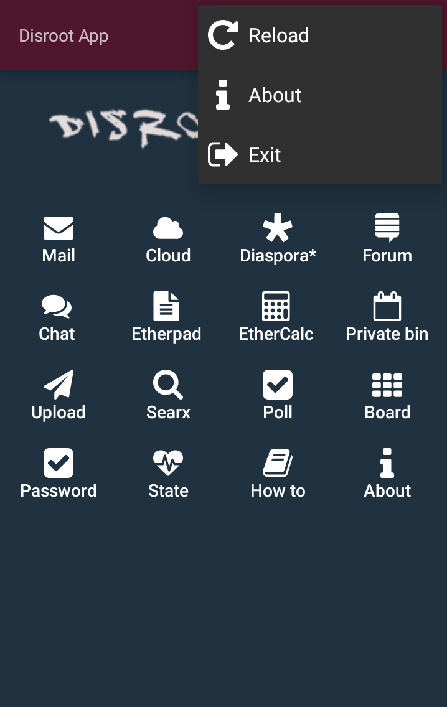
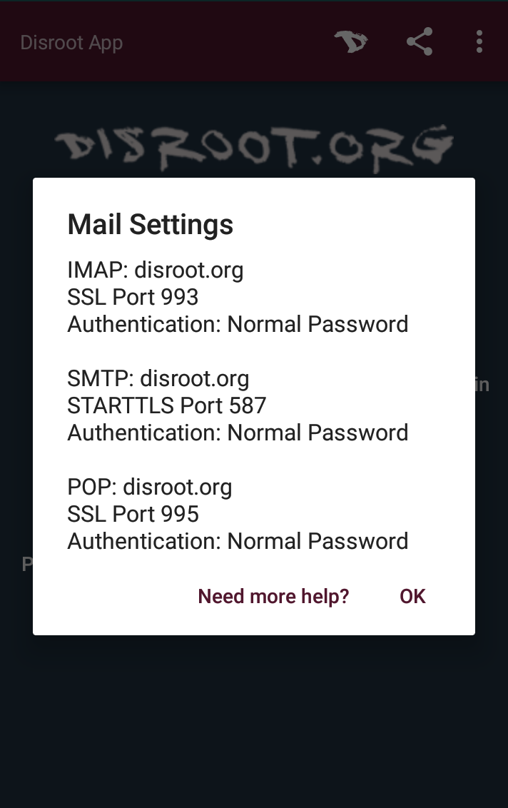

---
#Disroot app
Disroot is a platform providing online services based on principles of freedom, privacy, federation and decentralization.  
This app is like your Swiss Army knife to the Disroot platform, made by the community for the community.  
If you don't have a Disroot account you can still use this  app to access all the Disroot services that do not require an account:  
* Etherpad
* Ethercalc
* Private bin
* Upload
* Poll
* Searx
* Diaspora* (requires a Diaspora only account)   

The app may require you to install additional apps. We highly recommend you install F-Droid - a free and open source app marketplace - as not all apps can be found on Google's Play Store and F-Droid is more privacy oriented (no tracking, no account needed) you can download it [here](https://f-droid.org/FDroid.apk).

---
### Licensing
Licence GPLv3-only (see licence on source above)

#### Device Requirements
Android 4.1 or +
6 MB free on Smartphone

---
### Privacy & Permissions
This app requires access to the Internet and to external storage to be able to upload and download files.

---
###contributors
The project is always open for contributions and accepts pull requests.
* Massimiliano
* muppeth
* antilopa
* Fede
* Maryjane
* meaz

---
#### Resources
* Project: [Issues level/beginner](https://git.fosscommunity.in/disroot/disapp/issues) | [License](https://git.fosscommunity.in/disroot/disapp/blob/master/LICENCE.txt)
* Disroot: [Web](https://disroot.org) | [git](https://git.fosscommunity.in/disroot) | [Hubzilla Channel](https://hub.disroot.org/channel/disroot)
* F-droid: Not there yet.

---
### Screenshots

---
### Maintainers
- Disroot ([git](https://git.fosscommunity.in/disroot), [Web](https://disroot.org), [Hubzilla](https://hub.disroot.org/channel/disroot))
